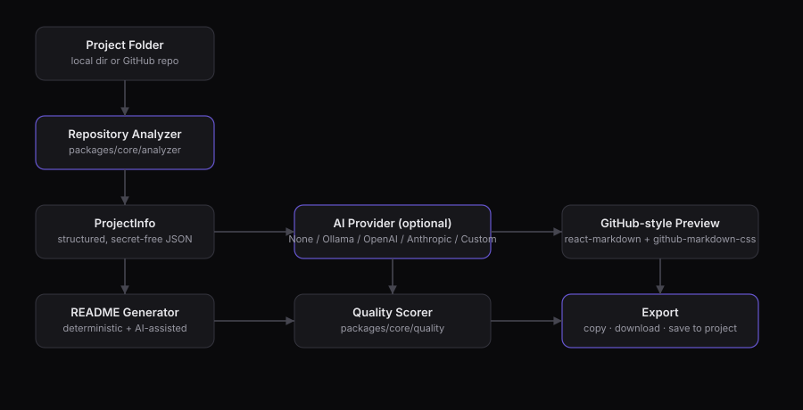

# ReadmeForge

A local-first AI README generator for developers.

ReadmeForge analyzes a real project — its languages, frameworks, scripts, environment variables, Docker/CI setup, license, and git history — and turns that into a professional, GitHub-ready `README.md`. It works fully offline in a deterministic mode, and can optionally call a local (Ollama) or remote (OpenAI/Anthropic/custom) model for richer prose. It never invents functionality it can't verify.

<p align="center">
  
</p>

## Features

- **Structured analysis first, AI second** — the analyzer builds a typed `ProjectInfo` object (language, framework, package manager, scripts, env vars, Docker/CI, license, git info) before anything is generated. Nothing is sent to an AI provider that wasn't already surfaced by the analyzer.
- **Secret-aware by default** — `.env`, `.env.local`, `.env.production`, credentials, private keys, certificates, `node_modules`, `.git`, and build output are excluded from analysis at the filesystem-walk level, not filtered after the fact. `.env.example` is read (it documents variable *names*, not secret values).
- **Works with no AI configured** — the deterministic generator produces a complete README from analyzer output alone. Sections that can't be verified (like an API section with no detected server framework) are explicitly marked as requiring user input instead of being invented.
- **Pluggable AI providers** — `AIProvider` is an interface with `NoneProvider` (deterministic), `LocalProvider` (Ollama), `OpenAIProvider`, `AnthropicProvider`, and `CustomProvider` (any OpenAI-compatible endpoint) behind it. Swapping or adding a provider doesn't touch generation or UI code.
- **Two-panel workspace** — toggle sections (Overview, Features, Installation, Usage, Configuration, Environment Variables, Architecture, API, Screenshots, Contributing, License), pick a style/length/audience, and regenerate. Edit the Markdown directly in a CodeMirror editor with search and undo/redo, or view it rendered.
- **GitHub-accurate preview** — headings, tables, code blocks with syntax highlighting, badges, blockquotes, and Mermaid diagrams rendered the way they'd look on github.com, including the window chrome.
- **Live quality score** — a 0–100 score computed from the actual Markdown content (not the generator's intent), broken down by category, with an "Improve README" action that asks the configured AI provider to strengthen the weak sections.
- **GitHub repository import** — paste a public repo URL to fetch its metadata via the GitHub REST API (no cloning, no auth) and see its current README's quality score before generating an improved one.
- **Screenshot handling** — drag-and-drop or browse for images, set alt text and placement (hero or Screenshots section), and they're written to `assets/` alongside the README on save — never collapsed into a collage.
- **Safe export** — copy to clipboard, download, or save straight into the project. Saving refuses to overwrite an existing `README.md` without explicit confirmation.
- **Git integration (optional, separate from the core generator)** — recent commit log, a generated changelog grouped by `feat`/`fix`/other, and a suggested commit message from staged changes.
- **CLI companion** — `readmeforge analyze|generate|check|preview <path>` shares the exact same `packages/core` logic as the web UI.

## Screenshots

Run the app locally (`npm run dev`, see below) to see the actual UI — the landing screen, the analysis progress view, the two-panel workspace with live editor/preview/GitHub-preview tabs, and the quality panel. No mockups are included here; what you see running is what's in the code.

## Architecture

```text
Project folder (local dir or GitHub URL)
        │
        ▼
Repository Analyzer  ──  packages/core/src/analyzer
        │  (excludes secrets before anything else happens)
        ▼
Structured ProjectInfo (JSON)
        │
        ▼
AI Provider (optional)  ──  packages/core/src/ai
  None · Ollama · OpenAI · Anthropic · Custom
        │
        ▼
README Generator  ──  packages/core/src/generator
        │
        ▼
Quality Scorer  ──  packages/core/src/quality
        │
        ▼
GitHub-style Preview (React) + Export (copy / download / save)
```

The codebase is split so `packages/core` never depends on Express or React — it's a plain Node/TypeScript library that both the web server and the CLI import directly.

```text
readmeforge/
├── packages/
│   └── core/                 # analyzer, generator, quality scorer, AI providers, GitHub import, git integration
│       ├── src/analyzer/     # language/framework/package-manager/docker/ci/license/env/git detection + secret exclusion
│       ├── src/generator/    # deterministic README generation, badges
│       ├── src/ai/           # AIProvider interface + None/Local/OpenAI/Anthropic/Custom implementations
│       ├── src/quality/      # README scoring
│       ├── src/export/       # save-to-disk, asset writing, size formatting
│       ├── src/github/       # public GitHub repo analysis via REST API
│       └── tests/            # vitest suite
├── apps/
│   ├── web/                  # React/Vite frontend + Express server (server/index.ts)
│   └── cli/                  # readmeforge CLI (shares packages/core)
└── assets/                   # repo-level assets (this README's diagram)
```

## Installation

```bash
git clone <this-repository-url>
cd readmeforge
npm install
```

## Development setup

```bash
npm run dev
```

This runs `apps/web`'s Express API (`http://localhost:4783`) and Vite dev server (`http://localhost:5183`, proxying `/api` to the server) concurrently. Open `http://localhost:5183`.

Run the core test suite:

```bash
npm run test -w packages/core
```

Build everything:

```bash
npm run build
```

## Usage

**Web app** — select a local folder (native macOS picker, or paste a path on other platforms) or paste a public GitHub URL, watch the analysis run, then use the workspace to toggle sections, pick a style/length/audience, edit, preview, check the quality score, and export.

**CLI**:

```bash
node apps/cli/dist/index.js analyze .    # print detected project metadata as JSON
node apps/cli/dist/index.js generate .   # write README.md (use --overwrite to replace an existing one)
node apps/cli/dist/index.js preview .    # print the generated README without writing it
node apps/cli/dist/index.js check .      # score the existing (or would-be) README
```

Install it as `readmeforge` globally with `npm link` inside `apps/cli` if you want the short form shown in `apps/cli/package.json`'s `bin` entry.

## AI provider configuration

No provider is required — the deterministic generator (`NoneProvider`) always works. To use a model:

| Provider | Setup |
| --- | --- |
| **Local (Ollama)** | Run Ollama locally (`ollama serve`, default `http://localhost:11434`). Nothing leaves your machine. Select it in the provider menu in the top-right of the workspace. |
| **OpenAI** | Paste an API key into the provider menu. Kept in `localStorage` in your browser only — never written to a file, never logged, never committed. |
| **Anthropic** | Same as OpenAI, using an Anthropic API key. |
| **Custom** | Any OpenAI-compatible `chat/completions` endpoint (LM Studio, vLLM, a LiteLLM proxy, etc.) — enter the endpoint URL. |

If a selected provider is unreachable or misconfigured, generation falls back to the deterministic generator rather than failing silently with fabricated content.

## Privacy

- Local projects are analyzed entirely on your machine. Nothing is uploaded unless you explicitly select and configure a remote AI provider (OpenAI/Anthropic/custom).
- `.env`, `.env.local`, `.env.production`, `*.pem`, `*.key`, `id_rsa`/`id_ed25519`, `credentials*`, and `secrets.*` are excluded at the directory-walk level in [`packages/core/src/analyzer/exclusions.ts`](packages/core/src/analyzer/exclusions.ts) — they are never read into memory for analysis, only checked by filename.
- `node_modules`, `.git`, build output (`dist`, `build`, `.next`, etc.) are skipped for both performance and privacy.
- `.env.example` is the one exception — it documents variable *names*, and values that look secret-like (long strings, common key prefixes) are redacted before being included in `ProjectInfo`.
- API keys for remote providers live in browser `localStorage`, are sent only to that provider's API on generation, and are never written to disk or committed to the repository.

## Roadmap

- Persisted provider presets per project (currently per-browser via `localStorage`)
- Richer Mermaid diagram authoring inside the editor
- Windows/Linux native folder picker (currently macOS via AppleScript, with a manual path fallback elsewhere)
- Streaming AI generation in the UI instead of a single request/response

## Contributing

See [CONTRIBUTING.md](CONTRIBUTING.md).

## License

MIT — see [LICENSE](LICENSE).
